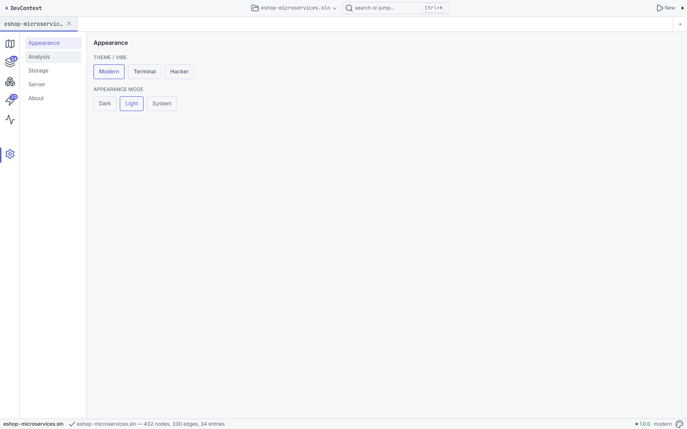

# DevContext — .NET codebase context for humans and LLMs

[](LICENSE)
[](global.json)
[](https://github.com/shaahink/DevContext2/actions/workflows/ci.yml)
[](src/DevContext.App)
[](src/DevContext.App/src-tauri)

> **Point it at any .NET repo and it gives you a Map (what's here) and a Trace (how things connect) — sized for an LLM prompt, readable by a human, and honest about how it got there.**

<p align="center">
  <a href="docs/screenshots/01-home.png">
    
  </a>
  <br>
  <em>Home page after analyzing a 7-service eShop microservices solution — identity strip, service map, topology tiles, and onboarding</em>
</p>

| | CLI | Desktop |
|---|-----|---------|
| **Platform** | Linux, macOS, Windows | Windows 10+ (build 19041+) |
| **Requires** | [.NET 10 SDK](https://dotnet.microsoft.com/download/dotnet/10.0) | Nothing — self-contained `.exe` |
| **Install** | `dotnet tool install -g DevContext.Cli` | [GitHub Releases](https://github.com/shaahink/DevContext2/releases) |

---

## What is DevContext?

DevContext turns any .NET solution into a **structured, queryable code graph** — not just syntax trees, but semantic understanding of architecture, wiring, entry points, data flow, and dependency injection. Use it to:

- **Onboard to an unfamiliar repo** in under a minute
- **Feed precise context to an LLM** — no token waste, no hallucinated code
- **Trace request flows** end-to-end, from HTTP endpoint through handlers, events, and database
- **Export LLM-ready context packs** with scope picker, token budget, and intent presets

<p align="center">
  <a href="docs/screenshots/02-atlas.png"></a>
  <a href="docs/screenshots/03-explore.png"></a>
  <br>
  <em>Atlas one-pager (left) and Explore workbench with entry deck + trace (right)</em>
</p>

---

## Features

### 🗺 Map & Trace Engine

Analyze any .NET solution once, then query it a hundred ways. The Map shows **what's in the repo** (architecture style, project topology, entry points, packages). The Trace walks **how things connect** — from an endpoint through MediatR handlers, MassTransit consumers, EF Core entities, and DI wiring.

<p align="center">
  <a href="docs/screenshots/04-graph.png"></a>
  <a href="docs/screenshots/05-code-inspector.png"></a>
  <br>
  <em>Interactive graph visualization (left) and source inspector with PrismJS syntax highlighting (right)</em>
</p>

### 🔬 Explore Workbench

The Explore view is your central workbench: an **entry deck** showing all entry points (HTTP endpoints, bus consumers, background services), an interactive **trace/inspector** panel, and an **interactive graph** that renders the call graph as a Cytoscape dagre layout. Switch between Service, Layer, Feature, and Flow lenses to understand the codebase from different angles.

### 📊 Table Lens & Insights

The **Table Lens** gives you a CDK-virtualized spreadsheet of every entry point with archetype columns, filterable and sortable. Export to CSV. The **Insights** page surfaces architecture findings grouped by severity — dependency violations, wiring gaps, pattern deviations.

<p align="center">
  <a href="docs/screenshots/06-table-lens.png"></a>
  <a href="docs/screenshots/07-insights.png"></a>
  <br>
  <em>Table lens — CDK-virtualized entry audit (left) and architecture insights (right)</em>
</p>

### 🧠 Context Studio

Assemble LLM-ready context packs with the **Context Studio** — a three-pane tool:
- **Scope picker** (left): browse services → entries as a tree, search with omnibox, use presets like *"I'm changing this endpoint"*
- **Composition view** (center): ordered cards for flows, signatures, bodies, DI wiring, config, entities, contracts, tests — drag to reorder, toggle body on/off
- **Budget panel** (right): token budget slider with per-card meter, intent selector (trace / explain / review), format (markdown / plain), Copy / Save with toast feedback

<p align="center">
  <a href="docs/screenshots/08-context-studio.png"></a>
  <a href="docs/screenshots/09-export.png"></a>
  <br>
  <em>Context Studio with scope picker + composition (left) and export/copy with token budget (right)</em>
</p>

### 🔌 MCP Integration

DevContext ships a built-in **MCP server** exposing 23 tools for AI agent integration. The desktop UI provides a full MCP management page — status card, configuration snippets, sessions table, live log feed, and a "Try a tool" sandbox. Use it to let any MCP-compatible agent query your codebase.

<p align="center">
  <a href="docs/screenshots/10-mcp.png"></a>
  <br>
  <em>MCP management page — status, config, sessions, live feed, try-a-tool sandbox</em>
</p>

---

## What it detects

| Detection | Finds |
|-----------|-------|
| **Endpoints** | Minimal API, FastEndpoints, MVC controller actions |
| **MediatR handlers** | `IRequestHandler<T,Q>`, commands, queries, notifications |
| **Message consumers** | MassTransit `IConsumer<T>`, NServiceBus, in-memory handlers |
| **EF Core entities** | DbContext, DbSet, `OnModelCreating` config, aggregate roots |
| **DI registrations** | `AddSingleton`/`AddScoped`/`AddTransient`, factory delegates |
| **Background workers** | `IHostedService`, `BackgroundService`, Quartz jobs |
| **Middleware pipeline** | `Use*` calls in Program.cs, registration order |
| **Cross-service links** | Bus-publish (MassTransit/RabbitMQ), gRPC, HTTP between services |
| **Architecture style** | Evidence-driven: Microservices, CleanArchitecture, NLayer, MinimalApi, etc. |
| **Call graph** | Roslyn syntactic call edges between solution types |

---

## How the trace engine works

The trace is a **structural traversal** over a typed CodeGraph — nodes and edges built at analyze time by joining detections into a connected graph. Each edge carries provenance (`file:line`), resolution (`Join`/`Syntactic`/`Semantic`), and confidence.

| Edge | Priority | Built from |
|------|----------|-----------|
| **Sends** | 0 (highest) | `.Send(new XCommand())` / `.Publish(new XEvent())` |
| **Handles** | 1 | MediatR handler join |
| **Raises** | 2 | `AddDomainEvent(new XEvent())` |
| **Consumes** | 3 | Event → handler join |
| **ReadsWrites** | 4 | EF entity + body reference |
| **Resolves** | 5 | DI registration + single-implementor |
| **WrappedBy** | 6 | `IPipelineBehavior` |
| **Calls** | 7 (lowest) | Roslyn call graph |

Depth limit (default 6), fan-out cap (12), framework boundary detection, revisit guard, and cycle breaking keep traces focused. [Full design →](docs/product/TRACE-ENGINE-DESIGN.md)

---

## Quickstart

**CLI:**
```bash
dotnet tool install -g DevContext.Cli
devcontext analyze .                              # Map (architecture overview)
devcontext analyze . --focus OrderService          # Trace from a type
devcontext analyze . --focus "GET /api/orders"     # Trace from an endpoint
devcontext analyze . --depth 6 --detail salient    # Full trace with source context
devcontext analyze . --stats                       # Timing, funnel, cache
devcontext analyze . --format json --strict        # JSON with validation
```

**Desktop:** Download from [Releases](https://github.com/shaahink/DevContext2/releases), unzip, run `DevContext.Desktop.exe`. Tabs: Home, Atlas, Explore, Table, Insights, Context Studio, MCP, Settings.

<p align="center">
  <a href="docs/screenshots/11-settings.png"></a>
  <br>
  <em>Settings — appearance, analysis defaults, storage, server, about</em>
</p>

---

## AI Agent Context

Designed for coding agents (Copilot, Cursor, Cline, etc.):

| File | For |
|------|-----|
| `AGENTS.md` | Cold-start, gate battery, architecture, resume protocol |
| `LOOM-START.md` | Phase tracker, current state, checkpoint table |
| `docs/dev/HANDOVER-LOOM.md` | **Read this first** — architecture, benchmarks, known gaps |
| `docs/dev/briefs/loom-graph-design.md` | Graph model, laws (R1/R2), pipeline design |
| `proto/devcontext/v1/devcontext.proto` | gRPC contract — single source of truth |

### Architecture

```
DevContext.Core (kernel)  —  Graph2: SymbolTable, BodyFacts, SemanticLitePopulator
├── DevContext.Cli         —  dotnet tool
├── DevContext.Server      —  gRPC-Web backend
├── DevContext.Mcp         —  MCP server (23 tools)
DevContext.App (Angular 22) — Tauri desktop, zoneless, signals
```

### Gate battery

```powershell
dotnet build DevContext.slnx                              # 0w 0e
dotnet test DevContext.slnx --filter "Category!=Eval"     # 518 tests
dotnet test DevContext.slnx --filter "Category=Truth"     # 9 pass / 2 skip
cd src/DevContext.App; pnpm check                          # lint + 27/27 + build
powershell -File scripts/loom-guards.ps1                   # 0 banned
```

---

## Development

```bash
dotnet build DevContext.slnx
dotnet test DevContext.slnx --filter "Category!=Eval"

# Desktop (browser mode):
cd src/DevContext.App
pnpm dev:web                              # Angular @ :4200 + .NET server

# Or with background services (AI agent friendly):
powershell -File scripts/start-dev-bg.ps1
node --experimental-strip-types scripts/capture-readme.mts --no-spawn
powershell -File scripts/start-dev-bg.ps1 -Kill
```

---

## License

MIT

---

<p align="center">
  <a href="docs/screenshots/12-home-full.png"></a>
  <br>
  <em>DevContext at rest — ready to analyze</em>
</p>
