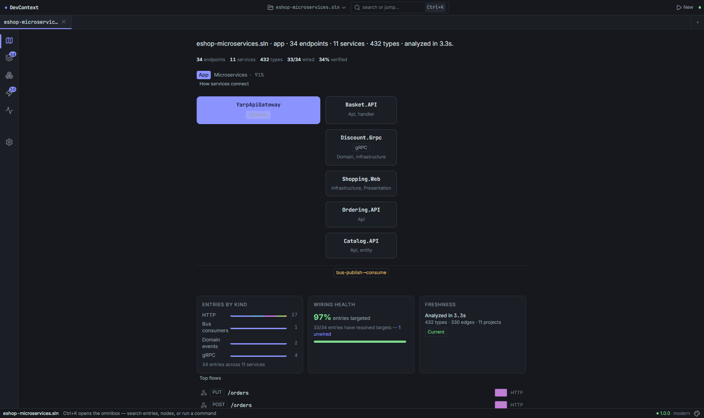
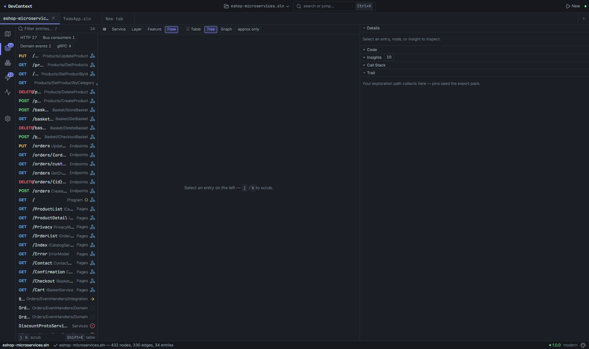
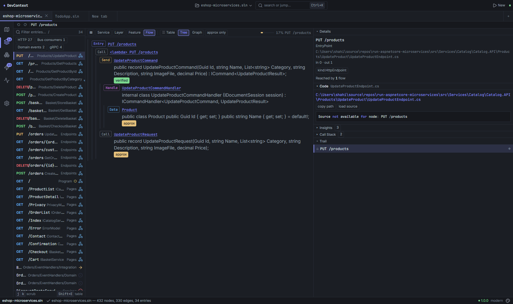
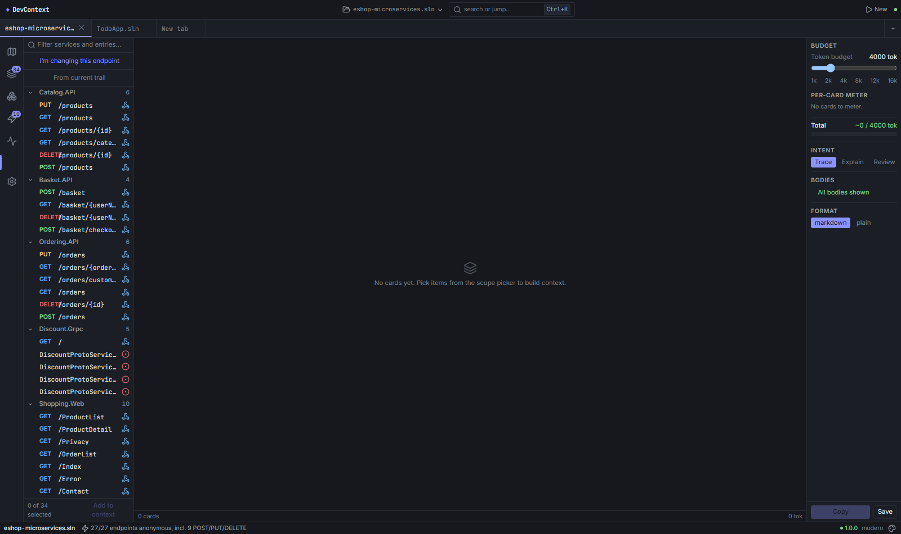
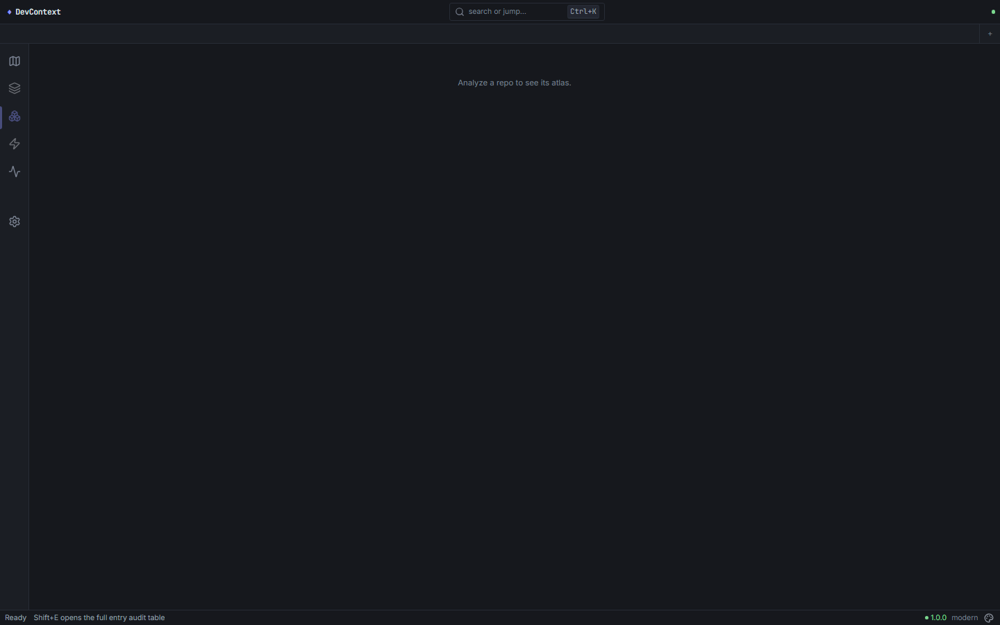
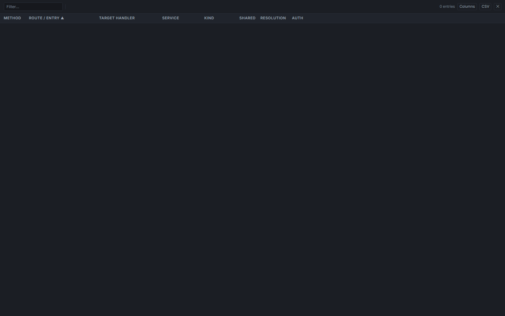
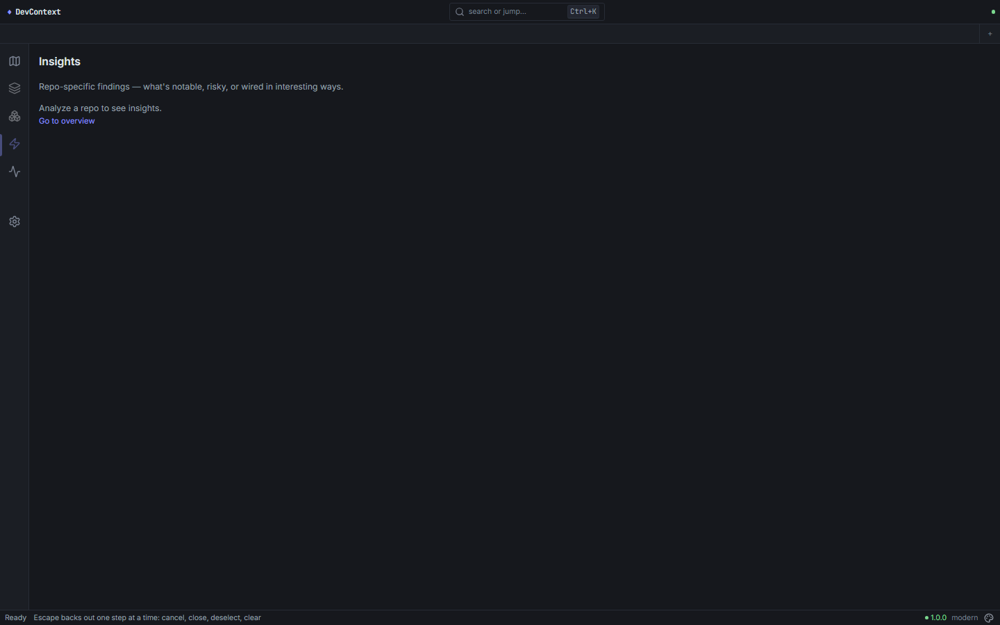
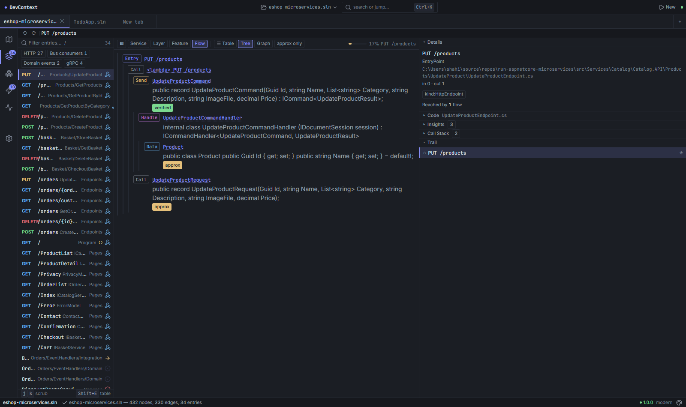

# DevContext — .NET codebase context for humans and LLMs

[](LICENSE)
[](global.json)
[](https://github.com/shaahink/DevContext2/actions/workflows/ci.yml)

**Point it at any .NET repo and it gives you a Map (what's here) and a Trace (how things connect) — sized for an LLM prompt, readable by a human, and honest about how it got there.**

| | CLI | Desktop |
|---|-----|---------|
| **Platform** | Linux, macOS, Windows | Windows 10+ (build 19041+) |
| **Requires** | [.NET 10 SDK](https://dotnet.microsoft.com/download/dotnet/10.0) | Nothing — self-contained `.exe` |
| **Download** | `dotnet tool install -g DevContext.Cli` | [GitHub Releases](https://github.com/shaahink/DevContext2/releases) |

---

## Screens (click to enlarge)

<table>
<tr>
  <td align="center" width="25%"><b>Home — Service Map</b><br><i>"What's in this repo?"</i></td>
  <td align="center" width="25%"><b>Explore — Trace Flows</b><br><i>"How does this work?"</i></td>
  <td align="center" width="25%"><b>Explore — Source Code</b><br><i>PrismJS-highlighted</i></td>
  <td align="center" width="25%"><b>Context Studio</b><br><i>Assemble LLM context</i></td>
</tr>
<tr>
  <td><a href="docs/screenshots/home.png"></a></td>
  <td><a href="docs/screenshots/explore.png"></a></td>
  <td><a href="docs/screenshots/code-pane.png"></a></td>
  <td><a href="docs/screenshots/context-studio.png"></a></td>
</tr>
</table>

<table>
<tr>
  <td align="center" width="25%"><b>Atlas — One-pager</b><br><i>Service diagram + event wiring</i></td>
  <td align="center" width="25%"><b>Table Lens</b><br><i>CDK-virtualized spreadsheet</i></td>
  <td align="center" width="25%"><b>Insights</b><br><i>Severity-grouped findings</i></td>
  <td align="center" width="25%"><b>Entry Details</b><br><i>Inspector + call stack</i></td>
</tr>
<tr>
  <td><a href="docs/screenshots/atlas.png"></a></td>
  <td><a href="docs/screenshots/table-lens.png"></a></td>
  <td><a href="docs/screenshots/insights.png"></a></td>
  <td><a href="docs/screenshots/explore-detail.png"></a></td>
</tr>
</table>

---

## There are exactly two situations

1. **You don't know the repo** → `devcontext analyze .` produces a **Map** (architecture style, tech stack, project topology, entry points, NuGet packages).
2. **You know where you're standing** → `devcontext analyze . --focus TypeName:Method` produces a **Trace** — call-stack tree from that entry point *down the wiring* (endpoint → send → handler → entities → events). `--depth 3` controls how far to follow.

## 30-second demo

```bash
dotnet tool install -g DevContext.Cli
devcontext analyze . --focus DiscoveryPipeline:RunAsync --depth 3
```

```
MAP  orders-microservices     (11 projects)
STACK  Carter · MediatR · EF Core · MassTransit · gRPC
STYLE  Microservices
TOPOLOGY (depends-on)
   Basket.API ── Catalog.API, Discount.Grpc
   Ordering.API ── Basket.API, Catalog.API

ENTRY POINTS
   HTTP (4): POST /api/orders, GET /api/orders, PUT /api/orders/cancel
   Bus (5): OrderPaymentSucceededConsumer, GracePeriodConfirmedConsumer
→ drill in: --focus "POST /basket/checkout" or --focus OrderService
```

No natural-language input, no query-box pretense — just Focus + Depth.

## What it extracts

| Detection | Finds |
|-----------|-------|
| **Endpoints** | Minimal API, FastEndpoints, MVC controller actions |
| **MediatR handlers** | `IRequestHandler<T,Q>`, commands, queries, notifications |
| **Message consumers** | MassTransit `IConsumer<T>`, NServiceBus, in-memory handlers |
| **EF Core entities** | DbContext, DbSet, `OnModelCreating` config, aggregate roots |
| **DI registrations** | `AddSingleton`/`AddScoped`/`AddTransient`, factory delegates |
| **Background workers** | `IHostedService`, `BackgroundService`, Quartz jobs |
| **Middleware pipeline** | `Use*` calls in Program.cs, registration order |
| **Cross-service links** | Bus-publish (MassTransit/RabbitMQ), gRPC, HTTP between services |
| **Architecture style** | Evidence-driven: Microservices, CleanArchitecture, NLayer, MinimalApi, etc. |
| **Call graph** | Roslyn syntactic call edges between solution types |

## Quickstart

**CLI:**
```bash
dotnet tool install -g DevContext.Cli
devcontext analyze .                              # Map (architecture overview)
devcontext analyze . --focus OrderService          # Trace from a type
devcontext analyze . --focus "GET /api/orders"     # Trace from an endpoint
devcontext analyze . --depth 6 --detail salient    # Full trace with source context
devcontext analyze . --stats                       # Timing, funnel, cache
devcontext analyze . --format json --strict        # JSON with validation
```

**Desktop:** Download from [Releases](https://github.com/shaahink/DevContext2/releases), unzip, run `DevContext.Desktop.exe`. Tabs: Home, Atlas, Explore, Table, Insights, Context Studio, MCP, Settings.

## The trace engine

The trace is a **structural traversal** over a typed CodeGraph — nodes and edges built at analyze time by joining detections into a connected graph. Each edge carries provenance (`file:line`), resolution (`Join`/`Syntactic`/`Semantic`), and confidence.

### How it walks the wiring

| Edge | Priority | Built from |
|------|----------|-----------|
| **Sends** | 0 (highest) | `.Send(new XCommand())` / `.Publish(new XEvent())` |
| **Handles** | 1 | MediatR handler join |
| **Raises** | 2 | `AddDomainEvent(new XEvent())` |
| **Consumes** | 3 | Event → handler join |
| **ReadsWrites** | 4 | EF entity + body reference |
| **Resolves** | 5 | DI registration + single-implementor |
| **WrappedBy** | 6 | `IPipelineBehavior` |
| **Calls** | 7 (lowest) | Roslyn call graph |

Depth limit (default 6), fan-out cap (12), framework boundary detection, revisit guard, and cycle breaking keep traces focused. [Full design →](docs/product/TRACE-ENGINE-DESIGN.md)

## Honest roadmap

**Solid today:** Map + Trace engine, 7 architecture styles, 12+ detection extractors, analyze-once-render-many, `--stats` everywhere, self-validating eval suite over 22 repos.

**Known limits:** Call edges are syntactic (marked `[approx]`). Non-CQRS repos (Carter, Minimal API without MediatR) produce shallower traces — see [HANDOVER-LOOM.md §7](docs/dev/HANDOVER-LOOM.md#7-known-gaps--honest-limitations).

**Deferred:** Beyond .NET (pipeline is language-agnostic), persistent snapshot cache, LLM-value benchmark.

## AI Agent Context

Designed for coding agents (Copilot, Cursor, etc.):

| File | For |
|------|-----|
| `AGENTS.md` | Cold-start, gate battery, architecture, resume protocol |
| `LOOM-START.md` | Phase tracker, current state, checkpoint table |
| `docs/dev/HANDOVER-LOOM.md` | **Read this first** — architecture, benchmarks, known gaps |
| `docs/dev/briefs/loom-graph-design.md` | Graph model, laws (R1/R2), pipeline design |
| `proto/devcontext/v1/devcontext.proto` | gRPC contract — single source of truth |

### Architecture

```
DevContext.Core (kernel)  —  Graph2: SymbolTable, BodyFacts, SemanticLitePopulator
├── DevContext.Cli         —  dotnet tool
├── DevContext.Server      —  gRPC-Web backend
├── DevContext.Mcp         —  MCP server (23 tools)
DevContext.App (Angular 22) — Tauri desktop, zoneless, signals
```

### Gate battery

```powershell
dotnet build DevContext.slnx                              # 0w 0e
dotnet test DevContext.slnx --filter "Category!=Eval"     # 518 tests
dotnet test DevContext.slnx --filter "Category=Truth"      # 9 pass / 2 skip
cd src/DevContext.App; pnpm check                          # lint + 27/27 + build
powershell -File scripts/loom-guards.ps1                   # 0 banned
```

## Development

```bash
dotnet build DevContext.slnx
dotnet test DevContext.slnx --filter "Category!=Eval"
cd src/DevContext.App; pnpm dev:web      # browser: Angular @ :4200 + server
```

## License

MIT
