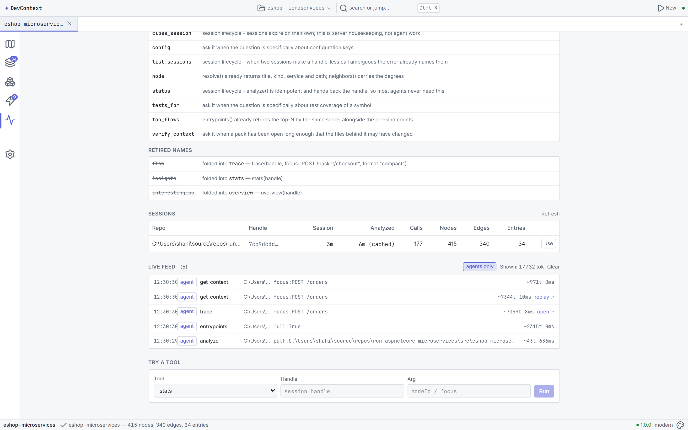

# DevContext — .NET codebase context for humans and LLMs

[](LICENSE)
[](global.json)
[](https://github.com/shaahink/DevContext2/actions/workflows/ci.yml)
[](src/DevContext.App)
[](src/DevContext.App/src-tauri)

> **Point it at any .NET repo and it gives you a Map (what's here) and a Trace (how things connect) — sized for an LLM prompt, readable by a human, and honest about how it got there.**

<p align="center">
  <a href="docs/screenshots/01-home.png">
    
  </a>
  <br>
  <em>Home page after analyzing a 7-service eShop microservices solution — identity strip, service map, topology tiles, and onboarding</em>
</p>

## One engine, four surfaces

Everything is powered by a single analysis engine (`DevContext.Core`): analyze a solution once, then
query it from whichever surface fits your workflow.

| Surface | What it's for | Get it |
|---------|---------------|--------|
| **CLI** (`devcontext`) | Scriptable Map/Trace in your terminal; JSON output for pipelines | Download the `.nupkg` from [Releases](https://github.com/shaahink/DevContext2/releases), then `dotnet tool install -g DevContext.Cli --add-source <download-folder>` (needs [.NET 10 SDK](https://dotnet.microsoft.com/download/dotnet/10.0); CI-verified on Windows, Linux, and macOS — see [Platform support](#platform-support); not yet published to NuGet.org) |
| **Desktop app** | Interactive exploration: graph, table lens, insights, Context Studio | Windows installer from [Releases](https://github.com/shaahink/DevContext2/releases) (needs the [.NET 10 runtime](https://dotnet.microsoft.com/download/dotnet/10.0)), or build from source — see [Quickstart](#quickstart) |
| **MCP server** (14 advertised tools + 8 unlisted specialists) | Let AI agents (Claude Code, Cursor, VS Code, …) query your codebase | Build + register — see [docs/product/mcp-reference.md](docs/product/mcp-reference.md) |
| **gRPC server** | Analyze-once, query-many backend that powers the app and MCP | Started automatically by the app/MCP; standalone via `dotnet run --project src/DevContext.Server` |

---

## What is DevContext?

DevContext turns any .NET solution into a **structured, queryable code graph** — not just syntax trees, but semantic understanding of architecture, wiring, entry points, data flow, and dependency injection. Use it to:

- **Onboard to an unfamiliar repo** in under a minute
- **Feed precise context to an LLM** — budgeted, and every section says which files it came from
- **Trace request flows** end-to-end, from HTTP endpoint through handlers, events, and database
- **Export LLM-ready context packs** with scope picker, token budget, and intent presets

<p align="center">
  <a href="docs/screenshots/02-atlas.png"></a>
  <a href="docs/screenshots/03-explore.png"></a>
  <br>
  <em>Atlas one-pager (left) and Explore workbench with entry deck + trace (right)</em>
</p>

---

## Features

### 🗺 Map & Trace Engine

Analyze any .NET solution once, then query it a hundred ways. The Map shows **what's in the repo** (architecture style, project topology, entry points, packages). The Trace walks **how things connect** — from an endpoint through MediatR handlers, MassTransit consumers, EF Core entities, and DI wiring.

<p align="center">
  <a href="docs/screenshots/04-graph.png"></a>
  <a href="docs/screenshots/05-code-inspector.png"></a>
  <br>
  <em>Interactive graph visualization (left) and source inspector with PrismJS syntax highlighting (right)</em>
</p>

### 🔬 Explore Workbench

The Explore view is your central workbench: an **entry deck** showing all entry points (HTTP endpoints, bus consumers, background services), an interactive **trace/inspector** panel, and an **interactive graph** that renders the call graph with Cytoscape over an ELK layered layout. Switch between Service, Layer, Feature, and Flow lenses to understand the codebase from different angles.

### 📊 Table Lens & Insights

The **Table Lens** gives you a CDK-virtualized spreadsheet of every entry point with archetype columns, filterable and sortable. Export to CSV. The **Insights** page surfaces architecture findings grouped by severity — dependency violations, wiring gaps, pattern deviations.

<p align="center">
  <a href="docs/screenshots/06-table-lens.png"></a>
  <a href="docs/screenshots/07-insights.png"></a>
  <br>
  <em>Table lens — CDK-virtualized entry audit (left) and architecture insights (right)</em>
</p>

### 🧠 Context Studio

Assemble LLM-ready context packs with the **Context Studio** — a three-pane tool:
- **Scope picker** (left): two tabs over one source — **Entries** (services → routes, with each row
  naming what it dispatches to) and **Types** (the public surface, so a library is scopeable too) —
  plus presets like *"I'm changing this endpoint"* and *From current trail* / pins
- **Composition view** (center): ordered cards for flows, signatures, bodies, **usage** ("who calls
  this"), DI wiring, config, entities, contracts, tests — drag to reorder, hide bodies per card
- **Budget panel** (right): token budget slider with per-card meter, intent selector (trace / explain / review), format (markdown / plain), Copy / **Save to repo** with toast feedback

Studio does not open empty after you have explored: its default state is a **proposed pack** built
from the current trail and pins. Every pack opens with an identity header (repo, archetype,
analyzed-at, git HEAD) and carries **per-section provenance** — which files each section came from,
how many items resolved semantically versus by heuristic, and a **verification ledger** for the
pack that was actually built (fresh / stale per cited file), beside an honest note about what the
budget cut.

**Hand it to your agent.** *Save to repo* writes the pack into the repo it describes —
`.devcontext/packs/<name>.md`, gitignored by default — and hands back a one-line instruction to
paste into `CLAUDE.md` or your agent prompt. The pack a human composed becomes the context an
agent reads, as a file in the tree rather than a paste that goes stale.

<p align="center">
  <a href="docs/screenshots/08-context-studio.png"></a>
  <a href="docs/screenshots/09-export.png"></a>
  <br>
  <em>Context Studio — Entries/Types picker + composed cards with per-card provenance (left); the same pack with its budget meter, verification ledger and omitted list (right)</em>
</p>

### 🔌 MCP Integration

DevContext ships a built-in **MCP server**. `tools/list` advertises a curated menu of **14 tools** — from `overview` and `trace` to budget-priced `get_context` packs — and **8 more are callable but unlisted** (session plumbing plus `config`, `tests_for`, `verify_context`), so an agent weighs 14 verbs instead of 22 but loses no capability. Every tool and every parameter carries a description; out-of-range enum values are rejected rather than silently re-read. Setup + full tool catalog: [docs/product/mcp-reference.md](docs/product/mcp-reference.md).

The desktop's **MCP page** is the room where you set that up and then watch it work. Its status
card *measures* rather than asserts: it probes for the `devcontext-mcp` binary and names the path
it found, reports how many watchers are attached and when an agent last called, and **Test
handshake** runs one real `initialize` + `tools/list` round trip against that exe. Each host card
carries a snippet with the resolved absolute path and a button that **writes the config file for
you** (`.mcp.json`, `.cursor/mcp.json`, `.vscode/mcp.json`) into the repo you have analyzed,
merging with servers already registered there. The **tool catalog is served by the MCP itself** —
the 14 advertised tools an agent actually sees, the 8 unlisted specialists, and the folded-away
names — so the page cannot drift from the menu.

<p align="center">
  <a href="docs/screenshots/10-mcp.png"></a>
  <a href="docs/screenshots/13-mcp-feed.png"></a>
  <br>
  <em>MCP page — measured status, write-the-config-for-me host cards and the served catalog (left);
  sessions and the live feed in the agent's own vocabulary (right), where a <code>trace</code> row
  opens its subject in Explore and a <code>get_context</code> row replays that pack in Studio</em>
</p>

#### What the agent story is, measured

Two things are worth saying plainly, because both are measured and one of them is a limit.

**Agents do reach for the tools — once the surface is legible.** In a pre-registered probe (18 headless
runs, 6 questions × 3 reps on eShop, prompt and questions byte-identical between arms), the share of an
agent's tool calls that went to DevContext rose from a median of **0.015** on the old 22-tool
undescribed surface to **0.306** on today's 14-tool described-and-curated one — past the **0.20** floor
that was written down before the runs. Adoption is not dominance: those runs still made 146 native
calls (Read/Grep/Bash/Glob) against 80 DevContext calls, and 11 of the 14 advertised tools were used at
least once. → [adoption gate evidence](eval-results/2026-08-14/a1-adoption-gate/A1.2-EVIDENCE.md) ·
[pre-registration](eval/agent-probe/DESIGN.md)

**Whether it makes an agent cheaper or more correct is NOT established.** The pilot that tried to
measure that was disqualified — adoption was near zero, so the contrast measured an unread tool menu,
not the engine. The honest description today is a **primer, not an accelerator**: it gives an agent an
oriented starting point. The unseen-repo study that would settle the accelerator claim has not been
run. → [pilot results, incl. why it was disqualified](eval-results/agent-probe/RESULTS.md)

---

## What it detects

| Detection | Finds |
|-----------|-------|
| **Endpoints** | Minimal API, FastEndpoints, MVC controller actions |
| **MediatR handlers** | `IRequestHandler<T,Q>`, commands, queries, notifications |
| **Message consumers** | MassTransit `IConsumer<T>`, NServiceBus, in-memory handlers |
| **EF Core entities** | DbContext, DbSet, `OnModelCreating` config, aggregate roots |
| **DI registrations** | `AddSingleton`/`AddScoped`/`AddTransient`, factory delegates |
| **Background workers** | `IHostedService`, `BackgroundService`, Quartz jobs |
| **Middleware pipeline** | `Use*` calls in Program.cs, registration order |
| **Cross-service links** | Bus-publish (MassTransit/RabbitMQ), gRPC, HTTP between services |
| **Architecture style** | Evidence-driven: Microservices, CleanArchitecture, NLayer, MinimalApi, etc. |
| **Call graph** | Roslyn syntactic call edges between solution types |

---

## How the trace engine works

The trace is a **structural traversal** over a typed CodeGraph — nodes and edges built at analyze time by joining detections into a connected graph. Each edge carries provenance (`file:line`), resolution (`Join`/`Syntactic`/`Semantic`), and confidence.

| Edge | Priority | Built from |
|------|----------|-----------|
| **Sends** | 0 (highest) | `.Send(new XCommand())` / `.Publish(new XEvent())` |
| **Handles** | 1 | MediatR handler join |
| **Raises** | 2 | `AddDomainEvent(new XEvent())` |
| **Consumes** | 3 | Event → handler join |
| **ReadsWrites** | 4 | EF entity + body reference |
| **Resolves** | 5 | DI registration + single-implementor |
| **WrappedBy** | 6 | `IPipelineBehavior` |
| **Calls** | 7 (lowest) | Roslyn call graph |

Depth limit (default 6), fan-out cap (12), framework boundary detection, revisit guard, and cycle breaking keep traces focused. [Full design →](docs/product/TRACE-ENGINE-DESIGN.md)

---

## Quickstart

### CLI

```bash
# Download DevContext.Cli.*.nupkg from https://github.com/shaahink/DevContext2/releases, then:
dotnet tool install -g DevContext.Cli --add-source <folder-containing-the-nupkg>
devcontext analyze .                              # Map (architecture overview)
devcontext analyze . --focus OrderService          # Trace from a type
devcontext analyze . --focus "GET /api/orders"     # Trace from an endpoint
devcontext analyze . --depth 6 --detail salient    # Full trace with source context
devcontext analyze . --sln new-cli/GitVersion.slnx # Pick a solution in a multi-solution repo
devcontext analyze . --stats                       # Timing, funnel, cache
devcontext analyze . --format json --strict        # JSON with validation
```

A repo with several solutions is several systems. DevContext analyses one of them and says which —
`analyzed src/GitVersion.slnx — 1 of 3 solutions in this repo` — so `--sln` is how you move to another
(by name, file name, or repo-relative path).

Full flag reference: [docs/product/cli-reference.md](docs/product/cli-reference.md) · configuration: [docs/product/configuration.md](docs/product/configuration.md)

### Desktop app

**Install (Windows):** download the installer (`DevContext_*_x64-setup.exe`) from [Releases](https://github.com/shaahink/DevContext2/releases) — it bundles the analysis server as a sidecar, and its version comes from the release tag. The app spawns the server via `dotnet`, so the [.NET 10 runtime](https://dotnet.microsoft.com/download/dotnet/10.0) must be installed.

**Or build from source** — requires the .NET 10 SDK, Node 22 + [pnpm](https://pnpm.io), and (for the native window) the [Tauri 2 prerequisites](https://v2.tauri.app/start/prerequisites/) on Windows:

```bash
dotnet build DevContext.slnx
cd src/DevContext.App
pnpm install
pnpm dev:web        # browser mode at http://localhost:4200 (server auto-started)
pnpm dev            # or: native Tauri window
pnpm tauri build    # or: build the installer yourself (bundles the server sidecar)
```

UI guide: [docs/product/desktop-ui.md](docs/product/desktop-ui.md)

### MCP (AI agents)

```bash
dotnet build DevContext.slnx
```

then register the built server with your MCP client:

```json
{
  "mcpServers": {
    "devcontext": {
      "command": "C:/path/to/DevContext2/src/DevContext.Mcp/bin/Debug/net10.0/devcontext-mcp.exe"
    }
  }
}
```

The MCP server auto-spawns the gRPC backend. All 22 tools (14 advertised, 8 unlisted), session model, and per-client snippets: [docs/product/mcp-reference.md](docs/product/mcp-reference.md)

### Platform support

Honest state, matching what CI actually verifies (not what the stack could do):

| Surface | Windows | Linux / macOS |
|---------|---------|----------------|
| CLI · engine · MCP · gRPC server (.NET 10) | ✅ CI-verified ([`ci.yml`](.github/workflows/ci.yml) engine matrix: build, tests, guards, CLI smoke) | ✅ CI-verified — the same engine job runs on ubuntu-latest and macos-latest (loom-guards stays on the Windows leg) |
| Web app (Angular) | ✅ | ✅ lint/test/build run on Linux CI (`ci.yml` app job) |
| Desktop installer (Tauri 2) | ✅ NSIS + MSI built by [`release.yml`](.github/workflows/release.yml) | ❌ Not built today (Tauri supports both; unscheduled) |

The developer harness (gate battery `eval/gates.ps1`, `scripts/loom-guards.ps1`) is Windows
PowerShell 5.1 — contributor workflows assume a Windows dev box even though the product CLI
itself is portable .NET and CI-verified on all three OSes.

---

## Documentation

| Doc | What's in it |
|-----|--------------|
| [docs/product/cli-reference.md](docs/product/cli-reference.md) | Every `devcontext analyze` flag, verified against source |
| [docs/product/configuration.md](docs/product/configuration.md) | `devcontext.json` schema and precedence |
| [docs/product/mcp-reference.md](docs/product/mcp-reference.md) | MCP setup + the tool catalog (14 advertised, 8 unlisted) |
| [docs/product/desktop-ui.md](docs/product/desktop-ui.md) | Desktop app tour, page by page |
| [docs/product/TRACE-ENGINE-DESIGN.md](docs/product/TRACE-ENGINE-DESIGN.md) | Trace engine internals: edges, priorities, caps |
| [docs/product/DETECTION-GUIDE.md](docs/product/DETECTION-GUIDE.md) | What each detector finds and its provenance |
| [docs/product/examples/](docs/product/examples/) | Real Map/Trace output on eShop, DntSite, and more |
| [CHANGELOG.md](CHANGELOG.md) | What changed in each release |
| [CONTRIBUTING.md](CONTRIBUTING.md) | Build, test, gate battery, conventions |

---

## AI Agent Context

Designed for coding agents (Claude Code, Copilot, Cursor, Cline, etc.):

| File | For |
|------|-----|
| `AGENTS.md` | **Read this first** — cold-start order, architecture, gate battery, worktree discipline |
| `docs/dev/DEVELOPER-PIPELINE.md` | The full developer pipeline: build, test, run, bench, eval |
| `docs/product/AGENT-REFERENCE.md` | Engine internals: ANALYZE→RENDER pipeline, Graph2, contracts |
| `docs/dev/CODE-MAP.md` | Source-verified module map — "where do I change X?" |
| `proto/devcontext/v1/devcontext.proto` | gRPC contract — single source of truth for server ⇄ app ⇄ MCP |

### Architecture

```
DevContext.Core (kernel)   —  analysis pipeline, Graph2 identity spine, BodyFacts, renderers
├── DevContext.Cli          —  `devcontext` dotnet tool
├── DevContext.Contracts    —  proto → C# gRPC codegen
├── DevContext.Server       —  gRPC-Web backend (analyze once, query many)
├── DevContext.Mcp          —  MCP server (14 advertised + 8 unlisted tools, stdio → gRPC proxy)
DevContext.App (Angular 22) —  Tauri 2 desktop, zoneless, signals — talks gRPC-Web to Server
```

### Gate battery (green before every commit)

The battery is one script — `eval/gates.ps1` — not a list of commands to remember. It runs build,
contract sweep, fast tests, the MCP QA + wire-truth drives, eval expectations, the CLI matrix, and the
app check, in that order, and stops at the first red naming the step.

```powershell
powershell -File eval/gates.ps1                    # full battery (merge/push boundary)
powershell -File eval/gates.ps1 -Scope engine -SkipEval   # fast engine loop
powershell -File eval/gates.ps1 -Scope app                # app only (~90s)
powershell -File scripts/loom-guards.ps1                  # banned patterns + truth gate
```

It takes a machine-wide lock first, so two checkouts on one box queue instead of killing each other's
servers. Windows PowerShell 5.1 — see [Platform support](#platform-support).

---

## Development

```bash
dotnet build DevContext.slnx
dotnet test DevContext.slnx --filter "Category!=Eval"

# Desktop (browser mode):
cd src/DevContext.App
pnpm dev:web                              # Angular @ :4200 + .NET server

# Or with background services (AI agent friendly):
powershell -File scripts/start-dev-bg.ps1
node --experimental-strip-types scripts/capture-readme.mts --no-spawn
powershell -File scripts/start-dev-bg.ps1 -Kill
```

---

## License

MIT

---

<p align="center">
  <a href="docs/screenshots/12-home-full.png"></a>
  <br>
  <em>DevContext at rest — ready to analyze</em>
</p>
